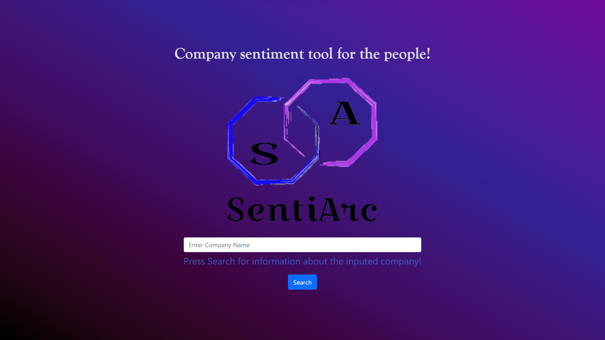

# SentiArc

SentiArc is a webapp that displays information about companies in a familiar and easy-to-understand form, with a focus on company sentiment. SentiArc is made up of 3 main pages: a tweets page that displays recent top tweets mentioning the inputed company, a news page that displays new and trending news articles about the inputed company, and a public interest page which displays the public interest in a company through an interactable graph of the company's public interest over the past five years and three easy-to-digest info cards with key statistics. 

## App Screen Shots:


Home Screen:




Landing Page:


Tweets Page:


News Page:


Public Interest Page:


## Tech Stack:
Frontend written using javascript / React, backend written in python using the Django web framework. Web scraping done using python scripts, either through interacting with existing APIs like twitter API and pytrends, or, in the case of web scraping the news, a custom API was created using beautifulSoup.


## Running SentiArc:
1. Download the codebase locally and install node dependencies using $ npm install
2. Install Django in a virtual environment in the project's root directory
3. Create a .env file in the root directory with two environmental variables specified: ```SECRET_KEY``` (Django secret key) and ```BEARER_TOKEN``` (Bearer token from Twitter API)
2. Start the server by running ```$ python manage.py``` runserver in the root directory
5. Start the webapp by opening a new terminal window, going to the /frontend directory, and running ```$ npm start```
